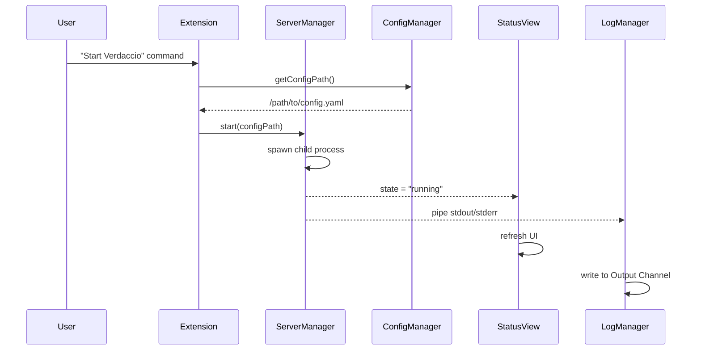
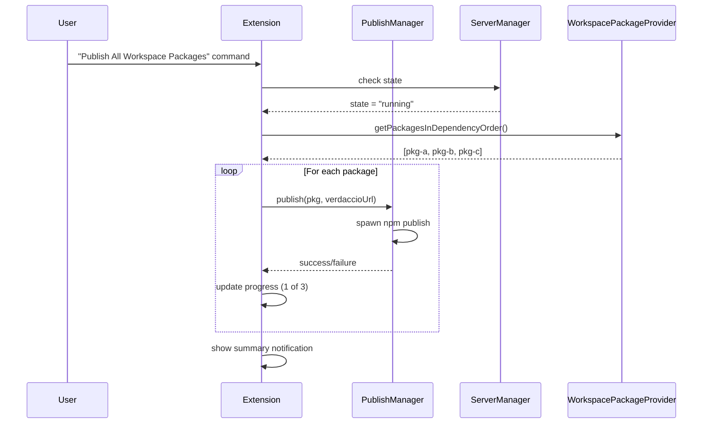
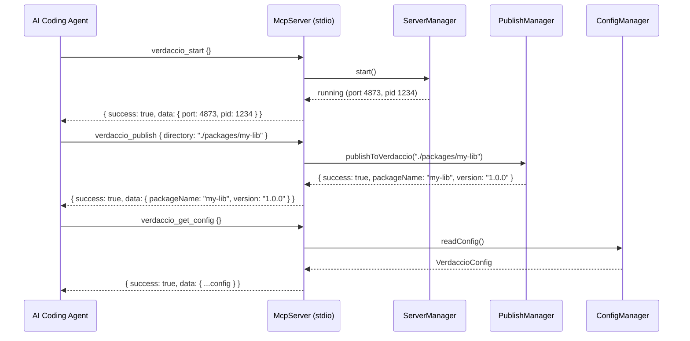
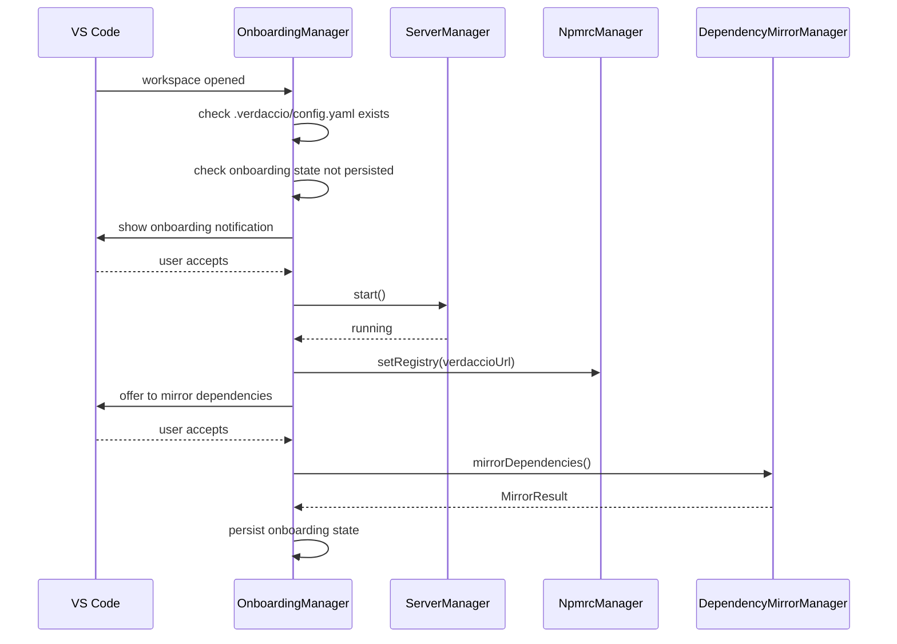

# Design Document: Verdaccio VS Code Extension

## Overview

This document describes the technical design for a VS Code extension that manages a local Verdaccio npm registry. The extension provides server lifecycle management, configuration editing, status monitoring, package browsing, log streaming, and npm client integration — all from within the VS Code UI.

The extension is implemented in TypeScript using the VS Code Extension API. It spawns and manages a child Verdaccio process, reads/writes YAML configuration, and presents information through tree views, webviews, status bar items, and output channels. It also manages scoped registries and auth tokens in `.npmrc`, provides uplink caching/failover policies, monitors storage usage with analytics, supports publish workflows (including monorepo bulk publish), and configures network proxy settings for corporate environments.

Additionally, the extension embeds an MCP server (extending `BaseMCPClient` from `@ai-capabilities-suite/mcp-client-base` v1.0.2 with stdio transport) that exposes all Verdaccio management operations as structured tool calls for AI coding agents. It integrates with the ACS shared status bar (`@ai-capabilities-suite/vscode-shared-status-bar` v1.0.21) for unified extension presence, ACS logging via `setOutputChannel()`, and ACS diagnostic commands. It provides a project onboarding flow that detects existing `.verdaccio` configurations and bootstraps the local registry environment, a dependency mirroring feature that caches all project dependencies from lockfiles for offline development, a registry health dashboard that monitors uplink latency and cache hit rates in real time, and named `.npmrc` profiles for quick context switching between registry configurations.

### Key Design Decisions

- **Child process management**: Use Node.js `child_process.spawn` to manage the Verdaccio server, giving full control over stdin/stdout/stderr and process signals.
- **YAML config editing**: Use the `js-yaml` library to parse and serialize the Verdaccio config file, preserving structure while enabling programmatic edits.
- **Tree views for browsing**: Use VS Code's `TreeDataProvider` API for the Status View and Cache View, which integrates naturally into the sidebar.
- **Webview for configuration**: Use a VS Code Webview Panel for the Configuration Panel, providing a richer form-based UI for editing settings.
- **File system watching**: Use VS Code's `FileSystemWatcher` to detect changes to the storage directory for automatic cache view refresh.
- **SecretStorage for tokens**: Use VS Code's `SecretStorage` API to persist auth tokens securely, avoiding plaintext storage in `.npmrc`.
- **Offline mode via config mutation**: Implement offline mode by snapshotting current uplink settings, then zeroing out `max_fails`/`fail_timeout` — restoring the snapshot on disable.
- **Dependency-order publish**: Use topological sort on workspace package dependency graphs to determine correct publish order for monorepo bulk publish.
- **NpmrcManager as the single .npmrc owner**: Extend the existing `NpmrcManager` with methods for scoped registries and auth tokens rather than creating separate managers, keeping all `.npmrc` mutations in one place.
- **MCP server as thin adapter**: The MCP server delegates every operation to the same manager instances used by the VS Code UI. It owns no business logic — it translates MCP tool calls into manager method calls and formats responses as JSON. Uses `@modelcontextprotocol/sdk` with stdio transport.
- **ACS ecosystem integration**: The extension integrates with the AI Capabilities Suite (ACS) by extending `BaseMCPClient` from `@ai-capabilities-suite/mcp-client-base` (v1.0.2) instead of using raw `@modelcontextprotocol/sdk` directly. This provides automatic timeout handling, exponential backoff reconnection, and connection state management. The extension registers with the ACS shared status bar (`@ai-capabilities-suite/vscode-shared-status-bar` v1.0.21) for unified presence, uses `setOutputChannel()` for ACS-consistent logging, and registers diagnostic commands for troubleshooting.
- **Onboarding via workspace detection**: On workspace open, check for `.verdaccio/config.yaml` existence. If found and not previously onboarded, offer a one-click bootstrap (start server, set registry, mirror deps). Persist onboarding state in `workspaceState` to avoid repeat prompts.
- **Lockfile-driven dependency mirroring**: Parse `package-lock.json` or `yarn.lock` to extract the full dependency list, then run `npm install`/`yarn install` with the registry pointed at Verdaccio to populate the local cache. Classify each dependency as "newly cached" or "already available" by checking storage before/after.
- **Health monitoring via periodic pings**: Use `http.get` to ping each uplink URL on a configurable interval (default 30s). Track latency, cache hit rate, and failure count per uplink. Derive health status from thresholds (healthy/degraded/unreachable).
- **Profile-based .npmrc switching**: Store named profiles as JSON files in `.verdaccio/profiles/`. Each profile captures the default registry, scoped registries, and auth token registry references. Switching a profile overwrites the workspace `.npmrc` with the stored configuration.

## Architecture

```mermaid
graph TD
    subgraph VS Code Extension Host
        A[Extension Entry Point] --> B[ServerManager]
        A --> C[ConfigManager]
        A --> D[StatusViewProvider]
        A --> E[CacheViewProvider]
        A --> F[LogManager]
        A --> G[NpmrcManager]
        A --> SA[StorageAnalyticsProvider]
        A --> PM[PublishManager]
        A --> WP[WorkspacePackageProvider]
        A --> MCP[McpServer]
        A --> OB[OnboardingManager]
        A --> DM[DependencyMirrorManager]
        A --> RH[RegistryHealthProvider]
        A --> PR[ProfileManager]
    end

    A -->|registerExtension| ACS_SB[ACS Shared Status Bar]
    A -->|setOutputChannel| ACS_SB
    A -->|diagnosticCommands| ACS_DIAG[ACS Diagnostics]

    B -->|spawn/kill| H[Verdaccio Process]
    C -->|read/write| I[config.yaml]
    E -->|scan| J[Storage Directory]
    F -->|pipe stdout/stderr| K[Output Channel]
    G -->|read/write| L[.npmrc]
    G -->|store/retrieve| M[SecretStorage]

    SA -->|analyze| J
    PM -->|npm publish| H
    PM -->|npm publish| N[Upstream Registry]
    WP -->|read| O[root package.json]

    MCP -->|delegates| B
    MCP -->|delegates| C
    MCP -->|delegates| G
    MCP -->|delegates| PM
    MCP -->|delegates| WP
    MCP -->|delegates| SA
    MCP -->|delegates| PR
    MCP -->|stdio| Q[AI Coding Agent]

    OB -->|detects| I
    OB -->|delegates| B
    OB -->|delegates| G
    OB -->|delegates| DM

    DM -->|reads| R[Lockfile]
    DM -->|npm/yarn install| H
    DM -->|checks| J

    RH -->|ping| N
    RH -->|reads| C

    PR -->|read/write| S[.verdaccio/profiles/]
    PR -->|delegates| G

    B -- state changes --> D
    B -- state changes --> SA
    B -- state changes --> RH
    B -- process output --> F
    H -- exit/error --> B
```



### Component Interaction Flow



### Publish Workflow Interaction Flow



### MCP Server Interaction Flow



### Onboarding Flow



## Components and Interfaces

### 1. ServerManager

Manages the Verdaccio child process lifecycle.

```typescript
interface IServerManager extends vscode.Disposable {
  readonly state: ServerState;
  readonly onDidChangeState: vscode.Event<ServerState>;
  readonly port: number | undefined;
  readonly startTime: Date | undefined;

  start(): Promise<void>;
  stop(): Promise<void>;
  restart(): Promise<void>;
}

type ServerState = "stopped" | "starting" | "running" | "error";
```

Responsibilities:
- Spawns Verdaccio via `child_process.spawn` with the active config file path
- Tracks process state and emits state change events
- Handles graceful shutdown with a 5-second timeout before force-kill (SIGTERM then SIGKILL)
- Buffers the last 20 lines of process output for error reporting
- Prevents duplicate starts (warns if already running)

### 2. ConfigManager

Reads, writes, and validates the Verdaccio YAML configuration.

```typescript
interface IConfigManager extends vscode.Disposable {
  getConfigPath(): string;
  readConfig(): Promise<VerdaccioConfig>;
  updateConfig(patch: Partial<VerdaccioConfig>): Promise<void>;
  generateDefaultConfig(): Promise<void>;
  configExists(): Promise<boolean>;
  openRawConfig(): Promise<void>;
}
```

Responsibilities:
- Resolves the config file path from VS Code settings (default: `.verdaccio/config.yaml`)
- Parses YAML to a typed object and serializes back
- Generates a default config file with sensible defaults when none exists
- Opens the raw YAML file in the VS Code editor

### 3. StatusViewProvider

Provides the sidebar tree view showing server status.

```typescript
interface IStatusViewProvider extends vscode.TreeDataProvider<StatusItem> {
  refresh(): void;
}
```

Responsibilities:
- Displays server state, listening address, uptime, and package count
- Subscribes to `ServerManager.onDidChangeState` for automatic updates
- Registered as a view in the Activity Bar

### 4. CacheViewProvider

Provides the sidebar tree view for browsing cached packages.

```typescript
interface ICacheViewProvider extends vscode.TreeDataProvider<CacheItem> {
  refresh(): void;
  deletePackage(item: CacheItem): Promise<void>;
}

type CacheItem = ScopeNode | PackageNode | VersionNode;
```

Responsibilities:
- Scans the storage directory and builds a scope → package → version tree
- Shows total storage size at the root level
- Displays package metadata (name, version, description, tarball size) on version selection
- Watches the storage directory for changes (auto-refresh within 5 seconds)
- Handles package deletion with confirmation prompt

### 5. LogManager

Streams Verdaccio process output to a VS Code Output Channel.

```typescript
interface ILogManager extends vscode.Disposable {
  attach(process: ChildProcess): void;
  show(): void;
}
```

Responsibilities:
- Creates and owns the "Verdaccio" Output Channel
- Pipes stdout and stderr from the child process in real time
- Respects the configured log level for filtering display

### 6. NpmrcManager

Manages the workspace `.npmrc` file for registry configuration, scoped registries, and auth tokens.

```typescript
interface INpmrcManager {
  // Existing (Req 6)
  setRegistry(address: string): Promise<void>;
  resetRegistry(): Promise<void>;

  // Scoped registries (Req 8)
  addScopedRegistry(scope: string, url: string): Promise<void>;
  editScopedRegistry(scope: string, newUrl: string): Promise<void>;
  removeScopedRegistry(scope: string): Promise<void>;
  listScopedRegistries(): Promise<ScopedRegistryEntry[]>;

  // Auth tokens (Req 9)
  addAuthToken(registryUrl: string, token: string): Promise<void>;
  rotateAuthToken(registryUrl: string, newToken: string): Promise<void>;
  removeAuthToken(registryUrl: string): Promise<void>;
  listAuthTokens(): Promise<AuthTokenEntry[]>;
  revealToken(registryUrl: string): Promise<string>;
}
```

Responsibilities:
- Reads/writes the workspace `.npmrc` to set/unset the `registry` field
- Validates that the server is running before setting the registry
- Optionally auto-sets/resets registry on server start/stop based on a VS Code setting
- Manages `@scope:registry=<url>` entries: add, edit, remove, list (Req 8)
- Validates scope names start with `@` and registry URLs are valid HTTP/HTTPS (Req 8.5)
- Creates `.npmrc` if it doesn't exist when adding entries (Req 8.6)
- Manages `//registry/:_authToken=<token>` entries: add, rotate, remove, list (Req 9)
- Stores/retrieves auth tokens via VS Code `SecretStorage` API (Req 9.2)
- Masks token display to `****<last4>` format (Req 9.3)
- Validates tokens are non-empty and non-whitespace (Req 9.7)
- Preserves all unrelated `.npmrc` lines during any mutation (round-trip, Req 8.7, 9.8)

### 7. StorageAnalyticsProvider

Provides storage usage metrics and cleanup operations.

```typescript
interface IStorageAnalyticsProvider extends vscode.TreeDataProvider<AnalyticsItem> {
  refresh(): void;
  computeAnalytics(): Promise<StorageAnalytics>;
  pruneOldVersions(packageName: string, keepCount: number): Promise<PruneResult>;
  bulkCleanup(packages: StalePackageInfo[]): Promise<PruneResult>;
  getStalePackages(): Promise<StalePackageInfo[]>;
}
```

Responsibilities:
- Computes total disk usage, package count, version count, top 5 largest packages, and stale package count (Req 11.7)
- Displays analytics in a dedicated tree view section in the sidebar (Req 11.7)
- Monitors storage against a configurable warning threshold (default 500 MB) and shows warnings (Req 11.2, 11.3)
- Identifies stale packages based on configurable staleness threshold in days (default 90, Req 11.5, 11.6)
- Prunes old versions keeping the N most recent (Req 11.4)
- Performs bulk cleanup of selected stale packages (Req 11.5)
- Prompts for confirmation before deletion, showing total size to be freed (Req 11.8)
- Refreshes Cache View and shows freed-space notification after cleanup (Req 11.9)

### 8. PublishManager

Handles package publishing, promotion, and version bumping.

```typescript
interface IPublishManager {
  publishToVerdaccio(packageDir: string): Promise<PublishResult>;
  promotePackage(packageName: string, version: string, targetRegistryUrl: string): Promise<PublishResult>;
  bumpVersion(packageDir: string, bumpType: SemverBumpType): Promise<string>;
  checkDuplicate(packageName: string, version: string): Promise<boolean>;
}

type SemverBumpType = "patch" | "minor" | "major" | "prerelease";

interface PublishResult {
  success: boolean;
  packageName: string;
  version: string;
  error?: string;
}
```

Responsibilities:
- Runs `npm publish --registry <verdaccio_url>` for local publishing (Req 12.1)
- Guards against publishing when server is not running (Req 12.2)
- Promotes packages by re-publishing tarballs to a target registry (Req 12.3)
- Runs `npm version <type>` for version bumping (Req 12.4)
- Shows success/error notifications with package name and version (Req 12.5, 12.6)
- Checks for duplicate name@version before publishing (Req 12.7)

### 9. WorkspacePackageProvider

Detects and displays monorepo workspace packages, and orchestrates bulk publish/unpublish.

```typescript
interface IWorkspacePackageProvider extends vscode.TreeDataProvider<WorkspacePackageItem> {
  refresh(): void;
  detectPackages(): Promise<WorkspacePackageInfo[]>;
  getPackagesInDependencyOrder(): Promise<WorkspacePackageInfo[]>;
  publishAll(): Promise<BulkPublishResult>;
  unpublishAll(): Promise<void>;
}

interface WorkspacePackageInfo {
  name: string;
  version: string;
  directory: string;
  dependencies: string[]; // names of workspace packages this depends on
}

interface BulkPublishResult {
  successes: PublishResult[];
  failures: PublishResult[];
}
```

Responsibilities:
- Reads `workspaces` field from root `package.json` and resolves glob patterns to package directories (Req 13.1)
- Displays detected packages with name and version in a tree view (Req 13.2)
- Publishes all packages in dependency order (topological sort) (Req 13.3)
- Continues on failure, collecting successes and failures for summary (Req 13.4)
- Unpublishes all workspace packages from storage after confirmation (Req 13.5)
- Shows progress indicator during bulk operations (Req 13.6)
- Guards against bulk operations when server is not running (Req 13.7)

### 10. McpServer

Embeds a Model Context Protocol server that exposes Verdaccio management as structured tool calls for AI coding agents. This is a thin adapter layer — it owns no business logic. Built by extending `BaseMCPClient` from the ACS ecosystem.

```typescript
import { BaseMCPClient } from '@ai-capabilities-suite/mcp-client-base';
import { diagnosticCommands } from '@ai-capabilities-suite/mcp-client-base';

class McpServer extends BaseMCPClient implements vscode.Disposable {
  /** Returns the command to spawn the verdaccio MCP server process */
  getServerCommand(): { command: string; args: string[] };

  /** Returns environment variables for the MCP server process */
  getServerEnv(): Record<string, string>;

  /** Called after the MCP connection is established; registers tools and initializes state */
  onServerReady(): Promise<void>;

  /** Invokes an MCP tool by name with the given parameters (inherited from BaseMCPClient) */
  callTool(name: string, params: Record<string, unknown>): Promise<unknown>;

  dispose(): void;
}
```

The MCP server extends `BaseMCPClient` from `@ai-capabilities-suite/mcp-client-base` (v1.0.2), which provides automatic timeout handling, exponential backoff reconnection, and connection state management. It registers 22 tools that delegate to the existing manager instances:

| MCP Tool | Delegates To | Parameters | Returns |
|---|---|---|---|
| `verdaccio_start` | ServerManager.start() | — | `{ port, pid }` |
| `verdaccio_stop` | ServerManager.stop() | — | `{ stopped: true }` |
| `verdaccio_status` | ServerManager (read state) | — | `{ state, port, uptimeSeconds, packageCount }` |
| `verdaccio_publish` | PublishManager.publishToVerdaccio() | `{ directory }` | `{ packageName, version }` |
| `verdaccio_publish_all` | WorkspacePackageProvider.publishAll() | — | `{ successes, failures }` |
| `verdaccio_list_packages` | CacheViewProvider (read tree) | — | `{ packages: [{ name, versions, sizes }] }` |
| `verdaccio_search` | CacheViewProvider (filter by pattern) | `{ pattern }` | `{ packages: [...] }` |
| `verdaccio_set_registry` | NpmrcManager.setRegistry() | — | `{ registry }` |
| `verdaccio_reset_registry` | NpmrcManager.resetRegistry() | — | `{ reset: true }` |
| `verdaccio_add_scoped_registry` | NpmrcManager.addScopedRegistry() | `{ scope, url }` | `{ scope, url }` |
| `verdaccio_set_offline_mode` | ConfigManager.enable/disableOfflineMode() | `{ enable }` | `{ offlineMode }` |
| `verdaccio_get_config` | ConfigManager.readConfig() | — | `{ config: {...} }` |
| `verdaccio_update_config` | ConfigManager.updateConfig() | `{ patch }` | `{ updated: true }` |
| `verdaccio_storage_analytics` | StorageAnalyticsProvider.computeAnalytics() | — | `StorageAnalytics` |
| `verdaccio_cleanup` | StorageAnalyticsProvider.pruneOldVersions/bulkCleanup() | `{ stalenessThresholdDays?, packageNames? }` | `{ deletedCount, freedBytes }` |
| `verdaccio_walk_cache` | CacheViewProvider (scan storage) | `{ scope?, pattern?, includeMetadata?, sortBy?, offset?, limit? }` | `CacheWalkerResponse` |
| `verdaccio_get_package` | CacheViewProvider (read package) | `{ packageName }` | `{ name, versions: [{ version, sizeBytes, description, publishDate, downloadCount? }] }` |
| `verdaccio_get_version` | CacheViewProvider (read version) | `{ packageName, version }` | `{ description, dependencies, devDependencies, tarballSize, publishDate }` |
| `verdaccio_check_cached` | CacheViewProvider (check storage) | `{ packages: string[] }` | `{ cached: string[], notCached: string[] }` |
| `verdaccio_cache_diff` | CacheViewProvider + DependencyMirrorManager (compare lockfile) | `{ lockfilePath? }` | `{ upToDate: DiffEntry[], outdated: DiffEntry[], missing: DiffEntry[] }` |
| `verdaccio_cache_stats` | CacheViewProvider + StorageAnalyticsProvider | — | `{ totalPackages, totalVersions, totalSizeBytes, cacheHitRate?, mostRecentlyCached?, oldestCached? }` |
| `verdaccio_package_deps` | CacheViewProvider (read deps tree) | `{ packageName, version, depth? }` | `{ name, version, cached, dependencies: [...] }` |

Responsibilities:
- Extends `BaseMCPClient` and implements `getServerCommand()`, `getServerEnv()`, and `onServerReady()` lifecycle methods (Req 15.1, 20.6)
- Uses `callTool(name, params)` inherited from `BaseMCPClient` for all tool invocations (Req 15.1)
- Registers with `diagnosticCommands` from `@ai-capabilities-suite/mcp-client-base` for ACS troubleshooting (Req 20.4)
- Initializes the MCP server on extension activation when `verdaccio.mcp.autoStart` is `true` (Req 15.20)
- Generates `.kiro/settings/mcp.json` discovery file on first activation (Req 15.21)
- Returns structured JSON responses with `success` boolean and `data`/`error` fields from every tool call (Req 15.18)
- Delegates all operations to the same manager instances used by the VS Code UI (Req 15.19)

### 11. OnboardingManager

Detects existing Verdaccio configurations in newly opened workspaces and orchestrates the bootstrap flow.

```typescript
interface IOnboardingManager extends vscode.Disposable {
  checkAndPrompt(): Promise<void>;
  runOnboarding(): Promise<void>;
}
```

Responsibilities:
- On workspace open, checks for `.verdaccio/config.yaml` existence (Req 16.1, 16.8)
- Checks `workspaceState` for persisted onboarding completion flag to avoid repeat prompts (Req 16.7)
- Displays onboarding notification offering to bootstrap the environment (Req 16.1)
- On accept: starts server, sets registry in `.npmrc`, offers to mirror dependencies (Req 16.2, 16.3, 16.4)
- Persists onboarding state on completion (Req 16.6)

### 12. DependencyMirrorManager

Caches all project dependencies locally by reading lockfiles and installing through Verdaccio.

```typescript
interface IDependencyMirrorManager {
  mirrorDependencies(): Promise<MirrorResult>;
  parseLockfile(): Promise<LockfileDependency[]>;
}
```

Responsibilities:
- Reads `package-lock.json` or `yarn.lock` from workspace root (Req 17.1, 17.6)
- Extracts all dependency entries with name and version (Req 17.1)
- Runs `npm install` or `yarn install` with registry pointed to Verdaccio (Req 16.5)
- Classifies each dependency as "newly cached" or "already available" by checking storage before the operation (Req 17.3)
- Shows progress indicator during mirroring (Req 17.2)
- Produces summary report with counts and total size of newly cached data (Req 17.4)
- Guards against mirroring when server is not running (Req 17.5)
- Shows error when no lockfile is found (Req 17.7)

### 13. RegistryHealthProvider

Monitors uplink connectivity and displays health metrics in a sidebar tree view.

```typescript
interface IRegistryHealthProvider extends vscode.TreeDataProvider<HealthItem> {
  refresh(): void;
  startMonitoring(): void;
  stopMonitoring(): void;
  getHealthStatus(uplinkName: string): UplinkHealthStatus;
  computeHealthState(latencyMs: number, failedCount: number, timedOut: boolean): HealthState;
  computeCacheHitRate(hits: number, misses: number): number;
}

type HealthState = "healthy" | "degraded" | "unreachable";

type HealthItem = UplinkHealthNode | HealthMetricNode;
```

Responsibilities:
- Displays one entry per configured uplink in the sidebar (Req 18.1)
- Periodically pings each uplink URL and displays response latency in ms (Req 18.2)
- Tracks and displays cache hit rate per uplink (Req 18.3)
- Maintains and displays failed request counter per uplink (Req 18.4)
- Computes health status: healthy (latency < 500ms, failures ≤ 3), degraded (latency ≥ 500ms or failures > 3), unreachable (timeout exceeded) (Req 18.5)
- Suggests enabling offline mode when all uplinks are unreachable (Req 18.6)
- Shows "server not running" message when Verdaccio is stopped (Req 18.7)

### 14. ProfileManager

Manages named `.npmrc` configuration profiles for quick context switching.

```typescript
interface IProfileManager {
  createProfile(name: string): Promise<void>;
  switchProfile(name: string): Promise<void>;
  deleteProfile(name: string): Promise<void>;
  listProfiles(): Promise<string[]>;
  getActiveProfile(): string | undefined;
}
```

Responsibilities:
- Saves current `.npmrc` state as a JSON file in `.verdaccio/profiles/<name>.json` (Req 19.1)
- Lists available profile names from the profiles directory (Req 19.2)
- Switches profile by reading JSON and overwriting workspace `.npmrc` (Req 19.3)
- Displays active profile name in the VS Code status bar (Req 19.4)
- Deletes profile JSON files with confirmation (Req 19.5)
- Stores profiles with fields: `name`, `registry`, `scopedRegistries`, `authTokenRegistries` (Req 19.6)
- Shows error with available profile names when switching to nonexistent profile (Req 19.8)

## Data Models

### VerdaccioConfig

Typed representation of the Verdaccio YAML configuration file (subset relevant to the extension).

```typescript
interface VerdaccioConfig {
  storage: string;
  listen: string; // e.g. "0.0.0.0:4873"
  max_body_size: string; // e.g. "10mb"
  log: {
    level: "fatal" | "error" | "warn" | "info" | "debug" | "trace";
  };
  uplinks: Record<string, UplinkConfig>;
  packages: Record<string, PackageAccessConfig>;
  http_proxy?: string; // global HTTP proxy (Req 14.3)
  https_proxy?: string; // global HTTPS proxy (Req 14.3)
  no_proxy?: string; // comma-separated no-proxy list (Req 14.5)
}

interface UplinkConfig {
  url: string;
  timeout: string; // e.g. "30s"
  maxage: string;
  max_fails: number;
  fail_timeout: string;
  cache_ttl?: string; // per-uplink cache TTL (Req 10.1)
  http_proxy?: string; // per-uplink proxy override (Req 14.4)
  https_proxy?: string; // per-uplink proxy override (Req 14.4)
}

interface PackageAccessConfig {
  access: string;
  publish: string;
  proxy: string[];
}
```

### ServerState Model

```typescript
interface ServerInfo {
  state: ServerState;
  port: number | undefined;
  startTime: Date | undefined;
  pid: number | undefined;
  lastError: string | undefined;
}
```

### CacheItem Models

```typescript
interface ScopeNode {
  type: "scope";
  name: string; // e.g. "@myorg"
  children: PackageNode[];
}

interface PackageNode {
  type: "package";
  name: string; // e.g. "my-lib"
  scope: string | undefined;
  path: string;
  versions: VersionNode[];
}

interface VersionNode {
  type: "version";
  version: string; // e.g. "1.2.3"
  description: string;
  tarballSize: number; // bytes
  packageName: string;
}
```

### Extension Settings

```typescript
interface ExtensionSettings {
  configPath: string; // default: ".verdaccio/config.yaml"
  autoSetRegistry: boolean; // default: false
  storageWarningThresholdMb: number; // default: 500 (Req 11.2)
  stalenessThresholdDays: number; // default: 90 (Req 11.6)
}
```

### Scoped Registry and Auth Token Models

```typescript
interface ScopedRegistryEntry {
  scope: string; // e.g. "@fortawesome"
  registryUrl: string; // e.g. "https://npm.fontawesome.com/"
}

interface AuthTokenEntry {
  registryUrl: string; // e.g. "registry.npmjs.org"
  maskedToken: string; // e.g. "****abcd"
}
```

### Offline Mode Snapshot

```typescript
interface UplinkSnapshot {
  /** Saved per-uplink settings before offline mode was enabled */
  uplinks: Record<string, Pick<UplinkConfig, "max_fails" | "fail_timeout">>;
}
```

### Storage Analytics Models

```typescript
interface StorageAnalytics {
  totalDiskUsageBytes: number;
  packageCount: number;
  versionCount: number;
  largestPackages: PackageSizeInfo[]; // top 5
  stalePackageCount: number;
}

interface PackageSizeInfo {
  name: string;
  version: string;
  sizeBytes: number;
}

interface StalePackageInfo {
  name: string;
  version: string;
  lastAccessDate: Date;
  sizeBytes: number;
}

interface PruneResult {
  deletedCount: number;
  freedBytes: number;
}

type AnalyticsItem = AnalyticsMetricNode | AnalyticsPackageNode;

interface AnalyticsMetricNode {
  type: "metric";
  label: string;
  value: string;
}

interface AnalyticsPackageNode {
  type: "largestPackage";
  name: string;
  sizeBytes: number;
}
```

### Workspace Package Models

```typescript
interface WorkspacePackageItem extends vscode.TreeItem {
  packageInfo: WorkspacePackageInfo;
}
```

### Validation Helpers

```typescript
/** Returns true if scope starts with '@' and contains no whitespace */
function isValidScope(scope: string): boolean;

/** Returns true if url is a valid http:// or https:// URL */
function isValidRegistryUrl(url: string): boolean;

/** Returns true if token is non-empty and not whitespace-only */
function isValidToken(token: string): boolean;

/** Masks a token to "****<last4>" format, or "****" if shorter than 4 chars */
function maskToken(token: string): string;
```

### MCP Response Models

```typescript
/** Standard envelope for all MCP tool responses (Req 15.18) */
interface McpToolResponse<T = unknown> {
  success: boolean;
  data?: T;
  error?: string;
}

/** Response from verdaccio_start */
interface McpStartResponse {
  port: number;
  pid: number;
}

/** Response from verdaccio_status */
interface McpStatusResponse {
  state: ServerState;
  port: number | undefined;
  uptimeSeconds: number | undefined;
  packageCount: number;
}

/** Response from verdaccio_list_packages / verdaccio_search */
interface McpPackageListResponse {
  packages: McpPackageEntry[];
}

interface McpPackageEntry {
  name: string;
  versions: string[];
  totalSizeBytes: number;
}

/** Response from verdaccio_cleanup */
interface McpCleanupResponse {
  deletedCount: number;
  freedBytes: number;
}
```

### Cache Walker Response Models

```typescript
/** Response from verdaccio_walk_cache (Req 15.25, 15.26, 15.27, 15.28) */
interface CacheWalkerResponse {
  packages: CacheWalkerPackage[];
  summary: {
    totalPackages: number;
    totalVersions: number;
    totalSizeBytes: number;
  };
}

interface CacheWalkerPackage {
  name: string;
  scope?: string;
  versionCount: number;
  totalSizeBytes: number;
  lastAccessDate?: string;
  origin: 'uplink' | 'published' | 'unknown';
  versions?: CacheWalkerVersion[];
}

interface CacheWalkerVersion {
  version: string;
  sizeBytes: number;
  description?: string;
  publishDate?: string;
}
```

### MCP Cache Inspection Response Models

```typescript
interface McpPackageDetailResponse {
  name: string;
  versions: McpVersionDetail[];
}

interface McpVersionDetail {
  version: string;
  sizeBytes: number;
  description: string;
  publishDate?: string;
  downloadCount?: number;
}

interface McpVersionMetadataResponse {
  description: string;
  dependencies: Record<string, string>;
  devDependencies: Record<string, string>;
  tarballSize: number;
  publishDate?: string;
}

interface McpCheckCachedResponse {
  cached: string[];
  notCached: string[];
}

interface CacheDiffEntry {
  name: string;
  requiredVersion: string;
  cachedVersion?: string;
}

interface McpCacheDiffResponse {
  upToDate: CacheDiffEntry[];
  outdated: CacheDiffEntry[];
  missing: CacheDiffEntry[];
}

interface McpCacheStatsResponse {
  totalPackages: number;
  totalVersions: number;
  totalSizeBytes: number;
  cacheHitRate?: number;
  mostRecentlyCached?: { name: string; version: string; date: string };
  oldestCached?: { name: string; version: string; date: string };
}

interface McpDepTreeNode {
  name: string;
  version: string;
  cached: boolean;
  dependencies: McpDepTreeNode[];
}
```

### Mirror Result Models

```typescript
interface MirrorResult {
  newlyCached: MirroredDependency[];
  alreadyAvailable: MirroredDependency[];
  totalNewSizeBytes: number;
}

interface MirroredDependency {
  name: string;
  version: string;
  sizeBytes: number;
}

interface LockfileDependency {
  name: string;
  version: string;
  resolved?: string; // tarball URL from lockfile
}
```

### Registry Health Models

```typescript
interface UplinkHealthStatus {
  uplinkName: string;
  url: string;
  latencyMs: number | undefined;
  cacheHitRate: number; // 0-100 percentage
  failedRequestCount: number;
  state: HealthState;
}

type HealthState = "healthy" | "degraded" | "unreachable";

interface UplinkHealthNode {
  type: "uplinkHealth";
  uplinkName: string;
  state: HealthState;
}

interface HealthMetricNode {
  type: "healthMetric";
  label: string;
  value: string;
}

type HealthItem = UplinkHealthNode | HealthMetricNode;
```

### Profile Models

```typescript
interface NpmrcProfile {
  name: string;
  registry: string | undefined; // default registry URL
  scopedRegistries: ScopedRegistryEntry[];
  authTokenRegistries: string[]; // registry URLs that have associated auth tokens
}
```

### Extended Extension Settings

```typescript
interface ExtensionSettings {
  configPath: string; // default: ".verdaccio/config.yaml"
  autoSetRegistry: boolean; // default: false
  storageWarningThresholdMb: number; // default: 500 (Req 11.2)
  stalenessThresholdDays: number; // default: 90 (Req 11.6)
  mcpAutoStart: boolean; // default: true (Req 15.20)
  healthPingIntervalMs: number; // default: 30000 (Req 18.2)
}
```


## Correctness Properties

*A property is a characteristic or behavior that should hold true across all valid executions of a system — essentially, a formal statement about what the system should do. Properties serve as the bridge between human-readable specifications and machine-verifiable correctness guarantees.*

### Property 1: Config patch round-trip

*For any* valid VerdaccioConfig object and any valid partial patch, serializing the patched config to YAML and re-parsing it should produce a config where the patched fields equal the patch values and all non-patched fields are preserved from the original.

**Validates: Requirements 2.3**

### Property 2: Uptime formatting correctness

*For any* start time and current time where current time >= start time, the formatted uptime string should represent a non-negative duration and correctly reflect the difference between the two times in hours, minutes, and seconds.

**Validates: Requirements 3.3**

### Property 3: Package tree grouping preserves all packages

*For any* list of package entries (some scoped, some unscoped), building the cache tree grouped by scope should produce a tree where every input package appears exactly once under its correct scope node (or under an "unscoped" root), and the total number of packages in the tree equals the input count.

**Validates: Requirements 4.1**

### Property 4: Storage size aggregation

*For any* list of packages with known tarball sizes, the total storage size displayed by the Cache View should equal the sum of all individual tarball sizes.

**Validates: Requirements 4.7**

### Property 5: Log level filtering

*For any* log entry with a given severity level and any configured log level threshold, the entry should be displayed if and only if its severity is at or above the configured threshold (using the ordering: trace < debug < info < warn < error < fatal).

**Validates: Requirements 5.4**

### Property 6: Npmrc registry round-trip

*For any* valid `.npmrc` file content, setting the registry to a Verdaccio address and then resetting it should produce `.npmrc` content that is equivalent to the original (with no residual registry entry), preserving all other configuration lines.

**Validates: Requirements 6.1, 6.2**

### Property 7: Scoped registry .npmrc round-trip

*For any* valid `.npmrc` file content and any valid scope/URL pair, adding a scoped registry entry and then removing the same scope should produce `.npmrc` content equivalent to the original, preserving all other lines.

**Validates: Requirements 8.4, 8.7**

### Property 8: Scope and URL validation

*For any* string, the scope validation function should accept it if and only if it starts with `@` and contains no whitespace. *For any* string, the URL validation function should accept it if and only if it is a well-formed `http://` or `https://` URL. This same URL validation applies to proxy URLs.

**Validates: Requirements 8.5, 14.7**

### Property 9: Auth token masking

*For any* non-empty token string, the masked representation should have the format `****<last N chars>` where N = min(4, token.length), and the masked output should never contain the full original token.

**Validates: Requirements 9.3**

### Property 10: Auth token .npmrc round-trip

*For any* valid `.npmrc` file content and any valid registry URL / token pair, adding an auth token entry and then removing the same registry's token should produce `.npmrc` content equivalent to the original, preserving all other lines.

**Validates: Requirements 9.5, 9.8**

### Property 11: Whitespace-only token rejection

*For any* string composed entirely of whitespace characters (including empty string), the token validation function should reject it. *For any* string containing at least one non-whitespace character, the token validation function should accept it.

**Validates: Requirements 9.7**

### Property 12: Offline mode round-trip

*For any* valid VerdaccioConfig with one or more uplinks, enabling offline mode should set all uplinks to `max_fails: 0` and `fail_timeout: "0"`, and subsequently disabling offline mode should restore each uplink's `max_fails` and `fail_timeout` to their original values.

**Validates: Requirements 10.4, 10.5**

### Property 13: Storage threshold warning trigger

*For any* total disk usage value (in bytes) and any configured warning threshold (in MB), the warning should be triggered if and only if the usage exceeds the threshold.

**Validates: Requirements 11.3**

### Property 14: Version pruning retains most recent N

*For any* list of package versions (each with a semver string and a publish date) and any positive keep count N, pruning should retain exactly the N most recently published versions and mark all others for deletion. If the list has N or fewer versions, none should be deleted.

**Validates: Requirements 11.4**

### Property 15: Stale package detection

*For any* list of packages with last-access dates and any staleness threshold in days, a package should be classified as stale if and only if its last-access date is more than the threshold number of days before the current date.

**Validates: Requirements 11.5**

### Property 16: Storage analytics computation

*For any* list of packages with known sizes, version counts, and last-access dates, the computed `StorageAnalytics` should satisfy: `totalDiskUsageBytes` equals the sum of all sizes, `packageCount` equals the number of distinct package names, `versionCount` equals the total number of versions, `largestPackages` contains the top 5 by size in descending order, and `stalePackageCount` equals the count of packages exceeding the staleness threshold.

**Validates: Requirements 11.7**

### Property 17: Dependency-order publish

*For any* set of workspace packages with inter-dependencies forming a DAG, the publish order returned by `getPackagesInDependencyOrder()` should be a valid topological sort — meaning for every package P that depends on package Q, Q appears before P in the order.

**Validates: Requirements 13.3**

### Property 18: MCP search returns only matching packages

*For any* list of packages in the storage directory and any name pattern string, the `verdaccio_search` MCP tool should return exactly those packages whose names match the provided pattern, with no false positives (non-matching packages included) and no false negatives (matching packages omitted).

**Validates: Requirements 15.9**

### Property 19: MCP response format consistency

*For any* MCP tool invocation (whether it succeeds or fails), the response should always contain a `success` boolean field, and when `success` is `true` the response should contain a `data` field, and when `success` is `false` the response should contain an `error` field.

**Validates: Requirements 15.18**

### Property 20: Lockfile dependency extraction completeness

*For any* valid `package-lock.json` or `yarn.lock` content, the parsed dependency list should contain every dependency entry present in the lockfile with the correct name and version, and the count of extracted dependencies should equal the count of dependency entries in the lockfile.

**Validates: Requirements 17.1, 17.6**

### Property 21: Mirror classification and summary consistency

*For any* set of dependencies to mirror and any pre-existing cache state, each dependency should be classified as "newly cached" if and only if its tarball did not exist in the storage directory before the operation. The summary should satisfy: `newlyCached.length + alreadyAvailable.length` equals the total dependency count, and `totalNewSizeBytes` equals the sum of sizes of all newly cached dependencies.

**Validates: Requirements 17.3, 17.4**

### Property 22: Cache hit rate computation

*For any* non-negative hit count and non-negative miss count where `hits + misses > 0`, the computed cache hit rate should equal `hits / (hits + misses) * 100`, and the result should be between 0 and 100 inclusive. When `hits + misses == 0`, the rate should be 0.

**Validates: Requirements 18.3**

### Property 23: Failed request counter accuracy

*For any* sequence of success and failure events for an uplink, the failed request counter should equal the number of failure events in the sequence.

**Validates: Requirements 18.4**

### Property 24: Health status classification

*For any* uplink latency value (in milliseconds), failed request count, and timeout boolean, the health status should be: "unreachable" when the uplink timed out, "degraded" when latency ≥ 500ms or failed request count > 3, and "healthy" otherwise.

**Validates: Requirements 18.5**

### Property 25: Profile round-trip

*For any* valid `.npmrc` file content containing a default registry, scoped registries, and auth token registry references, creating a profile from that content and then switching to that profile should produce `.npmrc` content equivalent to the original.

**Validates: Requirements 19.1, 19.3, 19.6**

### Property 26: Cache walker filtering and pagination

*For any* list of cached packages and any combination of `scope`, `pattern`, `sortBy`, `offset`, and `limit` parameters, the `verdaccio_walk_cache` tool should return exactly the subset of packages matching the scope and pattern filters, correctly sorted by the specified field, with the paginated slice starting at `offset` containing at most `limit` entries, and the `summary` object reflecting the pre-pagination totals (`totalPackages`, `totalVersions`, `totalSizeBytes`) computed across all matching packages before pagination is applied.

**Validates: Requirements 15.25, 15.26, 15.27, 15.28**

### Property 27: Cache diff correctness

*For any* lockfile dependency list and any cache state, the cache diff should classify every dependency into exactly one of `upToDate`, `outdated`, or `missing`, and the total count (`upToDate.length + outdated.length + missing.length`) should equal the lockfile dependency count.

**Validates: Requirements 15.32**

### Property 28: Dependency tree cached flag accuracy

*For any* package@version and any cache state, every node in the returned dependency tree should have `cached: true` if and only if the corresponding package@version exists in the storage directory.

**Validates: Requirements 15.34**

## Error Handling

| Scenario | Handling Strategy |
|---|---|
| Verdaccio process exits unexpectedly | Capture exit code + last 20 lines of output. Show error notification. Set state to "error". (Req 1.4) |
| Config file missing | Detect on first access. Offer to generate default config via quick pick. (Req 2.6) |
| Config file has invalid YAML | Catch parse error, show notification with line/column info, open raw file for manual fix. |
| Storage directory inaccessible | Show warning in Cache View root node. Log error to Output Channel. |
| Graceful shutdown timeout | Send SIGTERM, wait 5 seconds, then SIGKILL. Log the escalation. (Req 7.3) |
| `.npmrc` write failure | Catch I/O error, show notification, do not modify server state. |
| Verdaccio not installed | Detect missing `verdaccio` binary on start. Show error with install instructions. |
| Port already in use | Parse Verdaccio stderr for EADDRINUSE. Show notification suggesting a different port. |
| Invalid scope name | Validate `@` prefix before writing. Show validation error if missing. (Req 8.5) |
| Invalid registry/proxy URL | Validate HTTP/HTTPS scheme before writing. Show validation error if invalid. (Req 8.5, 14.7) |
| Empty or whitespace-only token | Reject with validation error before writing to `.npmrc` or SecretStorage. (Req 9.7) |
| SecretStorage unavailable | Catch error, fall back to `.npmrc`-only storage, warn user tokens are not securely stored. |
| Token reveal after deletion | If token not found in SecretStorage, show info message that token is no longer available. |
| Offline mode snapshot missing | If no snapshot exists when disabling offline mode, restore uplinks to default values and warn user. |
| Storage threshold exceeded | Show warning notification with current usage and threshold. (Req 11.3) |
| Prune/cleanup on empty storage | Show info message that no packages match the criteria. No deletion performed. |
| Publish when server not running | Show warning and offer to start server before publishing. (Req 12.2, 13.7) |
| Duplicate package version on publish | Warn user that name@version already exists. Offer to overwrite or cancel. (Req 12.7) |
| npm publish command failure | Capture stderr, show error notification with npm output. (Req 12.6) |
| Bulk publish partial failure | Continue publishing remaining packages. Show summary of successes and failures. (Req 13.4) |
| Circular dependency in workspace | Detect cycle during topological sort. Show error listing the cycle. Abort bulk publish. |
| `.npmrc` file does not exist | Create the file when adding scoped registry or auth token entries. (Req 8.6) |
| MCP tool invocation when manager unavailable | Return `{ success: false, error: "..." }` with descriptive message. Never throw unhandled exceptions from MCP handlers. (Req 15.18) |
| MCP server fails to start | Log error to Output Channel. Show warning notification. Extension continues without MCP support. (Req 15.20) |
| `.kiro/settings/mcp.json` write failure | Log warning. MCP server still functions but may not be discoverable by agents. (Req 15.21) |
| Onboarding config detection fails | Silently skip onboarding. Do not show error to user. (Req 16.8) |
| Lockfile not found during mirror | Show error notification instructing user to run `npm install` or `yarn install` first. (Req 17.7) |
| Lockfile parse failure | Show error notification with parse error details. Suggest regenerating the lockfile. |
| Mirror when server not running | Show warning and offer to start server before mirroring. (Req 17.5) |
| Uplink ping timeout | Mark uplink as "unreachable". Continue monitoring other uplinks. (Req 18.5) |
| All uplinks unreachable | Show notification suggesting offline mode. (Req 18.6) |
| Health monitoring when server stopped | Display "server not running" message in health view. (Req 18.7) |
| Profile not found on switch | Show error notification listing available profile names. (Req 19.8) |
| Profile directory does not exist | Create `.verdaccio/profiles/` directory on first profile creation. |
| Profile JSON parse failure | Show error notification. Suggest deleting and recreating the profile. |

## Testing Strategy

### Unit Tests (Example-Based)

Unit tests cover specific scenarios, edge cases, and component interactions using mocks for VS Code APIs and the file system.

Key areas:
- **ServerManager**: State transitions (stopped → starting → running → stopped), duplicate start guard (Req 1.6), error notification construction (Req 1.4)
- **ConfigManager**: Default config generation (Req 2.6), config path resolution (Req 2.5), raw config open command (Req 2.7)
- **StatusViewProvider**: Tree item rendering for each server state (Req 3.1, 3.2), activity bar registration (Req 3.6)
- **CacheViewProvider**: Version listing (Req 4.2), metadata display (Req 4.3), delete confirmation prompt (Req 4.5)
- **LogManager**: Output channel creation (Req 5.1), show command (Req 5.3)
- **NpmrcManager**: Server-not-running guard (Req 6.3), auto-set/reset setting (Req 6.4), `.npmrc` creation when missing (Req 8.6), scoped registry add/edit/remove (Req 8.1, 8.3, 8.4), auth token add/rotate/remove/reveal (Req 9.1, 9.4, 9.5, 9.6), SecretStorage integration (Req 9.2)
- **ConfigManager (uplink/proxy)**: Cache-first sets maxage to 9999d (Req 10.7), proxy-first sets maxage to 0 (Req 10.8), global proxy write (Req 14.3), per-uplink proxy write (Req 14.4), restart prompt on running server (Req 10.9, 14.6)
- **StorageAnalyticsProvider**: Threshold warning display (Req 11.3), prune confirmation prompt (Req 11.8), cleanup notification (Req 11.9), settings defaults (Req 11.2, 11.6)
- **PublishManager**: Server-not-running guard (Req 12.2), success/error notifications (Req 12.5, 12.6), duplicate detection (Req 12.7), version bump command construction (Req 12.4)
- **WorkspacePackageProvider**: Tree view rendering (Req 13.2), partial failure summary (Req 13.4), unpublish confirmation (Req 13.5), progress indicator (Req 13.6), server-not-running guard (Req 13.7)
- **Extension lifecycle**: Activation events (Req 7.2), deactivation cleanup (Req 7.1)
- **McpServer**: Tool registration (all 22 tools registered, Req 15.2), delegation to correct manager for each tool (Req 15.3–15.17, 15.19, 15.25, 15.29–15.34), response envelope format (Req 15.18), autoStart setting (Req 15.20), mcp.json generation (Req 15.21), ACS shared status bar registration/unregistration (Req 20.2, 20.3), ACS diagnostic commands registration (Req 20.4), ACS output channel setup (Req 20.5), BaseMCPClient lifecycle methods (Req 20.6)
- **OnboardingManager**: Config detection triggers notification (Req 16.1), skips when no config (Req 16.8), skips when already onboarded (Req 16.7), persists state on completion (Req 16.6), delegates to ServerManager/NpmrcManager (Req 16.2, 16.3)
- **DependencyMirrorManager**: Lockfile detection and parsing (Req 17.1, 17.6), no-lockfile error (Req 17.7), server-not-running guard (Req 17.5), progress indicator (Req 17.2), summary report (Req 17.4)
- **RegistryHealthProvider**: Tree view shows one entry per uplink (Req 18.1), offline mode suggestion when all unreachable (Req 18.6), server-not-running message (Req 18.7)
- **ProfileManager**: Create/switch/delete/list profiles (Req 19.1, 19.3, 19.5, 19.2), status bar display (Req 19.4), nonexistent profile error (Req 19.8), JSON schema (Req 19.6)

### Property-Based Tests

Property-based tests use [fast-check](https://github.com/dubzzz/fast-check) to verify universal properties across randomly generated inputs. Each test runs a minimum of 100 iterations.

| Property | Test Description | Tag |
|---|---|---|
| Property 1 | Generate random VerdaccioConfig + random patches, verify round-trip | Feature: verdaccio-vscode-extension, Property 1: Config patch round-trip |
| Property 2 | Generate random Date pairs, verify uptime string correctness | Feature: verdaccio-vscode-extension, Property 2: Uptime formatting correctness |
| Property 3 | Generate random package lists with mixed scopes, verify tree structure | Feature: verdaccio-vscode-extension, Property 3: Package tree grouping preserves all packages |
| Property 4 | Generate random size arrays, verify sum equals displayed total | Feature: verdaccio-vscode-extension, Property 4: Storage size aggregation |
| Property 5 | Generate random log entries and thresholds, verify filtering | Feature: verdaccio-vscode-extension, Property 5: Log level filtering |
| Property 6 | Generate random .npmrc content + registry URLs, verify set/reset round-trip | Feature: verdaccio-vscode-extension, Property 6: Npmrc registry round-trip |
| Property 7 | Generate random .npmrc content + scope/URL pairs, verify add/remove round-trip | Feature: verdaccio-vscode-extension, Property 7: Scoped registry .npmrc round-trip |
| Property 8 | Generate random strings, verify scope validation (@-prefix) and URL validation (http/https) | Feature: verdaccio-vscode-extension, Property 8: Scope and URL validation |
| Property 9 | Generate random token strings, verify masking format (****last4) and no full token leak | Feature: verdaccio-vscode-extension, Property 9: Auth token masking |
| Property 10 | Generate random .npmrc content + registry/token pairs, verify add/remove round-trip | Feature: verdaccio-vscode-extension, Property 10: Auth token .npmrc round-trip |
| Property 11 | Generate random whitespace strings and non-whitespace strings, verify rejection/acceptance | Feature: verdaccio-vscode-extension, Property 11: Whitespace-only token rejection |
| Property 12 | Generate random configs with uplinks, enable/disable offline mode, verify round-trip | Feature: verdaccio-vscode-extension, Property 12: Offline mode round-trip |
| Property 13 | Generate random usage values and thresholds, verify warning trigger condition | Feature: verdaccio-vscode-extension, Property 13: Storage threshold warning trigger |
| Property 14 | Generate random version lists with dates + keep count, verify correct versions retained | Feature: verdaccio-vscode-extension, Property 14: Version pruning retains most recent N |
| Property 15 | Generate random packages with access dates + threshold, verify stale classification | Feature: verdaccio-vscode-extension, Property 15: Stale package detection |
| Property 16 | Generate random package data, verify all analytics metrics computed correctly | Feature: verdaccio-vscode-extension, Property 16: Storage analytics computation |
| Property 17 | Generate random DAGs of workspace packages, verify topological sort order | Feature: verdaccio-vscode-extension, Property 17: Dependency-order publish |
| Property 18 | Generate random package lists + name patterns, verify search returns exactly matching packages | Feature: verdaccio-vscode-extension, Property 18: MCP search returns only matching packages |
| Property 19 | Invoke each MCP tool with success/failure scenarios, verify response always has `success` + `data`/`error` | Feature: verdaccio-vscode-extension, Property 19: MCP response format consistency |
| Property 20 | Generate random lockfile content (package-lock.json and yarn.lock formats), verify all dependencies extracted | Feature: verdaccio-vscode-extension, Property 20: Lockfile dependency extraction completeness |
| Property 21 | Generate random dependency sets + pre-existing cache states, verify classification and summary consistency | Feature: verdaccio-vscode-extension, Property 21: Mirror classification and summary consistency |
| Property 22 | Generate random hit/miss counts, verify cache hit rate = hits/(hits+misses)*100 and is in [0,100] | Feature: verdaccio-vscode-extension, Property 22: Cache hit rate computation |
| Property 23 | Generate random sequences of success/failure events, verify counter equals failure count | Feature: verdaccio-vscode-extension, Property 23: Failed request counter accuracy |
| Property 24 | Generate random latency values, failure counts, and timeout flags, verify health classification | Feature: verdaccio-vscode-extension, Property 24: Health status classification |
| Property 25 | Generate random .npmrc content with registries/scopes/tokens, create profile then switch, verify round-trip | Feature: verdaccio-vscode-extension, Property 25: Profile round-trip |
| Property 26 | Generate random cached package lists + scope/pattern/sortBy/offset/limit params, verify filtered subset, sort order, pagination slice, and summary totals | Feature: verdaccio-vscode-extension, Property 26: Cache walker filtering and pagination |
| Property 27 | Generate random lockfile dependency lists + cache states, verify every dependency classified into exactly one bucket and total count matches | Feature: verdaccio-vscode-extension, Property 27: Cache diff correctness |
| Property 28 | Generate random package@version + cache states, verify every dependency tree node's `cached` flag matches storage directory presence | Feature: verdaccio-vscode-extension, Property 28: Dependency tree cached flag accuracy |

### Integration Tests

Integration tests verify end-to-end behavior with a real or mocked Verdaccio process:

- Server start/stop/restart lifecycle (Req 1.1, 1.2, 1.5)
- Process output streaming to Output Channel (Req 5.2)
- File system watcher triggers Cache View refresh (Req 4.6)
- Status View updates within 2 seconds of state change (Req 3.5)
- Graceful shutdown with 5-second timeout escalation to force-kill (Req 7.3)
- Package deletion from storage directory (Req 4.4)
- `npm publish` command execution against running Verdaccio (Req 12.1)
- Package promotion to upstream registry (Req 12.3)
- Bulk publish of workspace packages in dependency order (Req 13.3)
- SecretStorage token persistence and retrieval (Req 9.2)
- MCP server stdio transport communication with tool invocation and JSON response (Req 15.1, 15.18)
- ACS shared status bar registration on activation and unregistration on deactivation (Req 20.2, 20.3)
- ACS diagnostic commands registration and output channel setup (Req 20.4, 20.5)
- Onboarding flow end-to-end: detect config, start server, set registry, mirror deps (Req 16.1–16.6)
- Dependency mirroring with real lockfile parsing and install command execution (Req 17.1, 17.6)
- Uplink health ping with real HTTP requests and latency measurement (Req 18.2)
- Profile create/switch round-trip with file system persistence (Req 19.1, 19.3)
